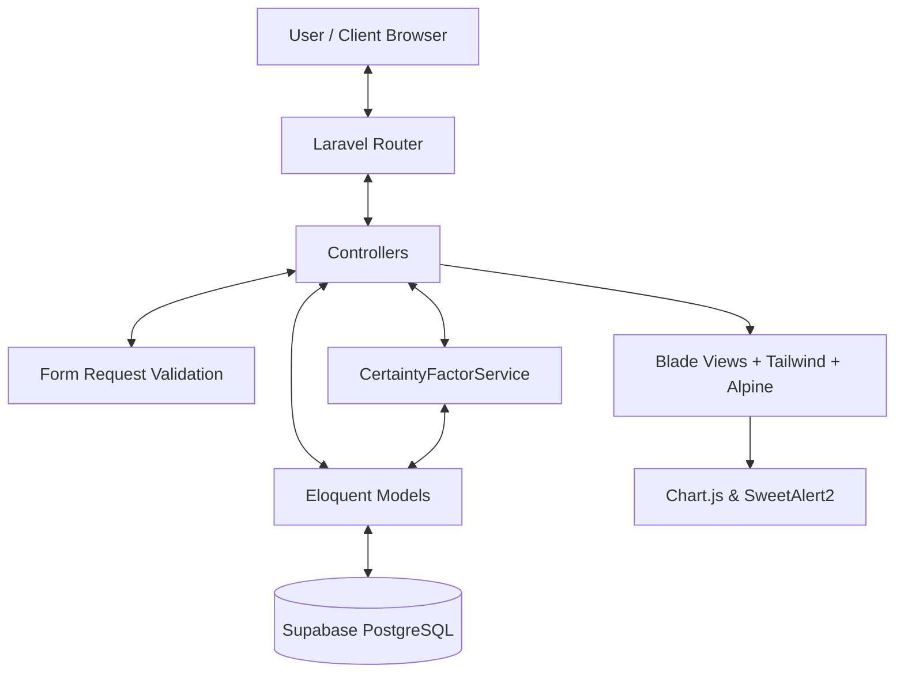
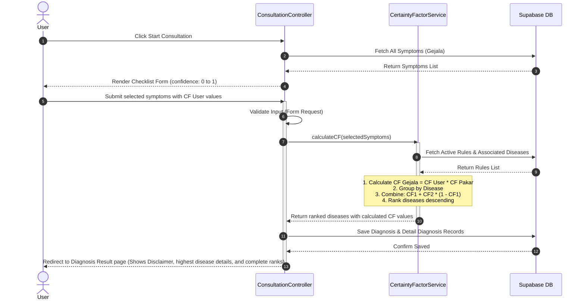
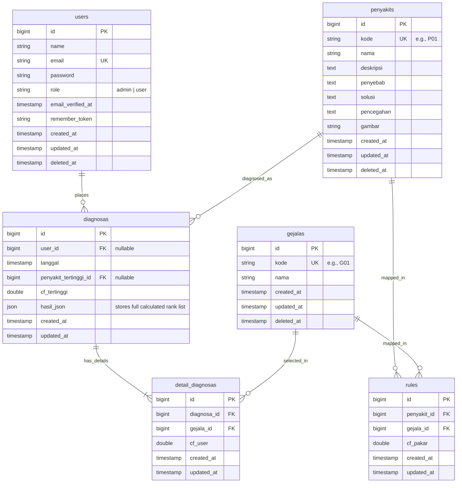
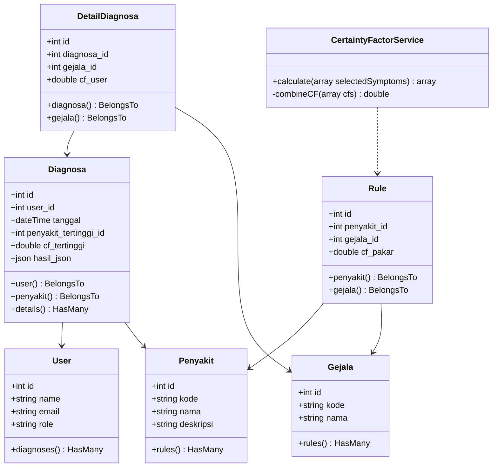

# Implementation Plan: SkinExpert - Skin Disease Expert System

This document outlines the design and implementation plan for **SkinExpert**, a Full Stack Laravel 12 expert system for skin disease screening using the **Certainty Factor (CF)** method.

## Goal Description

Build a modern, production-ready Full Stack web application called **SkinExpert**. The application acts as a screening and educational tool for skin diseases. It will run on Laravel 12, PHP 8.3, and use Supabase PostgreSQL as its database. The frontend is built using Blade, Tailwind CSS, Alpine.js, and Chart.js.

## System Design & Architecture

### 1. System Architecture Diagram
The system follows a standard Laravel MVC architecture extended with a **Service Layer** to isolate the Certainty Factor inference engine, ensuring SOLID, DRY, and clean code principles.



### 2. Use Case Diagram
Describes the actions that can be performed by the two user roles: **Admin** and **User**.

```mermaid
left_to_right_direction
actor Admin
actor User as "Registered User"
actor Guest as "Guest User"

rectangle SkinExpert {
    Guest --> (Landing Page)
    Guest --> (Register)
    Guest --> (Login)
    
    User --> (User Dashboard)
    User --> (Start Diagnosis Consultation)
    User --> (View Diagnosis History)
    User --> (View Profile & Edit Profile)
    
    Admin --> (Admin Dashboard & Stats)
    Admin --> (CRUD Penyakit)
    Admin --> (CRUD Gejala)
    Admin --> (CRUD Rule Basis Pengetahuan)
    Admin --> (CRUD User Management)
    Admin --> (View All Diagnoses & Export PDF)
}
```

### 3. Activity Diagram: Consultation & CF Calculation Flow
Visualizes the flow when a user performs a skin consultation.



### 4. Entity Relationship Diagram (ERD)
The database structure with relationships mapped on Supabase PostgreSQL.



### 5. Class Diagram


---

## User Review Required

> [!IMPORTANT]
> **PHP Version Requirements**: Laravel 12 requires PHP 8.2 or 8.3. The current default PHP in the workspace CLI is PHP 8.1.10. I will download PHP 8.3.12 (Windows zip) and extract it to `C:\laragon\bin\php\php-8.3.12-Win32-vs16-x64` to configure the system to run Laravel 12 successfully. The downloaded package is ~30MB.

> [!WARNING]
> **Supabase Connection Details**: To connect to your Supabase PostgreSQL instance, please ensure you provide database credentials. If you haven't set up a Supabase project yet, I will use placeholder configuration in `.env` so you can fill it in.

---

## Open Questions

1. **Supabase Database Credentials**:
   Do you have a specific Supabase connection URL or credentials (host, dbname, user, password, port) you want me to write to `.env` immediately, or should I use placeholders for you to fill in?
   *Recommendation: Let's use placeholders first, and you can supply or edit them, or provide them now.*

2. **PHP 8.3.12 Download**:
   Are you okay with me running automated PowerShell scripts to download the PHP 8.3.12 zip from `https://windows.php.net/downloads/releases/archives/php-8.3.12-Win32-vs16-x64.zip` and extract it?
   *Recommendation: Approve this so we can compile/run Laravel 12 smoothly.*

---

## Proposed Changes

### [Backend Infrastructure]

#### [NEW] [php.ini](file:///C:/laragon/bin/php/php-8.3.12-Win32-vs16-x64/php.ini)
Create and configure `php.ini` inside the new PHP folder, enabling extensions like `pdo_pgsql`, `pgsql`, `openssl`, `mbstring`, `curl`, `fileinfo`, `gd`, and `zip`.

### [Laravel Core Components]

#### [NEW] [CertaintyFactorService.php](file:///c:/Users/Lenovo/Documents/Praktikum/SkinExpert/app/Services/CertaintyFactorService.php)
The service layer that implements the CF mathematical engine.
- Calculates `CF_gejala = CF_user * CF_pakar`.
- Combines multiple CFs: `CF_combine = CF1 + CF2 * (1 - CF1)`.
- Sorts and maps rules to diseases.

#### [NEW] [Penyakit.php](file:///c:/Users/Lenovo/Documents/Praktikum/SkinExpert/app/Models/Penyakit.php)
#### [NEW] [Gejala.php](file:///c:/Users/Lenovo/Documents/Praktikum/SkinExpert/app/Models/Gejala.php)
#### [NEW] [Rule.php](file:///c:/Users/Lenovo/Documents/Praktikum/SkinExpert/app/Models/Rule.php)
#### [NEW] [Diagnosa.php](file:///c:/Users/Lenovo/Documents/Praktikum/SkinExpert/app/Models/Diagnosa.php)
#### [NEW] [DetailDiagnosa.php](file:///c:/Users/Lenovo/Documents/Praktikum/SkinExpert/app/Models/DetailDiagnosa.php)
Models for handling CRUD operations and Eloquent relationships.

### [Migrations & Seeders]

#### [NEW] [migrations/](file:///c:/Users/Lenovo/Documents/Praktikum/SkinExpert/database/migrations/)
Database schema definitions for tables: `users`, `penyakits`, `gejalas`, `rules`, `diagnosas`, and `detail_diagnosas` with proper foreign keys and constraints.

#### [NEW] [seeders/](file:///c:/Users/Lenovo/Documents/Praktikum/SkinExpert/database/seeders/)
Seeders to prepopulate database:
- Admin user (`admin@gmail.com` / `password`).
- 10 skin diseases (dermatitis, psoriasis, acne, etc.).
- 35 skin symptoms.
- 60 rules mappings.
- Dummy diagnoses history.

### [Controllers & Routing]

#### [NEW] [ConsultationController.php](file:///c:/Users/Lenovo/Documents/Praktikum/SkinExpert/app/Http/Controllers/ConsultationController.php)
Manages user consultation processes (showing the form, receiving symptoms, invoking the CF service, saving results, showing diagnosis details).

#### [NEW] [DiseaseController.php](file:///c:/Users/Lenovo/Documents/Praktikum/SkinExpert/app/Http/Controllers/Admin/DiseaseController.php)
#### [NEW] [SymptomController.php](file:///c:/Users/Lenovo/Documents/Praktikum/SkinExpert/app/Http/Controllers/Admin/SymptomController.php)
#### [NEW] [RuleController.php](file:///c:/Users/Lenovo/Documents/Praktikum/SkinExpert/app/Http/Controllers/Admin/RuleController.php)
#### [NEW] [UserController.php](file:///c:/Users/Lenovo/Documents/Praktikum/SkinExpert/app/Http/Controllers/Admin/UserController.php)
#### [NEW] [DashboardController.php](file:///c:/Users/Lenovo/Documents/Praktikum/SkinExpert/app/Http/Controllers/DashboardController.php)
Controllers for CRUD and dashboards.

### [Frontend Components]

#### [NEW] [layouts/](file:///c:/Users/Lenovo/Documents/Praktikum/SkinExpert/resources/views/layouts/)
Modern dashboard layout with sidebar navigation, responsiveness, modern font (Poppins), and custom styling.

#### [NEW] [landing.blade.php](file:///c:/Users/Lenovo/Documents/Praktikum/SkinExpert/resources/views/landing.blade.php)
Landing page layout with CTA, FAQ, testimonials, features, and modern look.

---

## Verification Plan

### Automated Tests
- Implement a test script/unit test: `tests/Unit/CertaintyFactorTest.php` to verify:
  - Singular symptom calculation: `CF_user * CF_pakar`.
  - Multiple symptoms combine calculations against expected output results.
  - Command: `php artisan test`

### Manual Verification
- Deploy local server (`php artisan serve`) and inspect:
  - Landing page styling and responsiveness.
  - User flows: Consultation form, checkboxes selection, calculation results page with disclaimer.
  - Admin flows: Managing symptoms, diseases, rules, and export PDF.
  - Test dashboard analytics charts.
